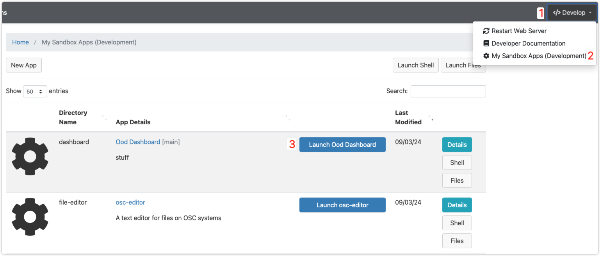

# Gautschi Open OnDemand Dashboard

## About

The [Gautschi OOD Dashboard](https://www.rcac.purdue.edu/compute/gautschi), powered by [Open OnDemand](https://openondemand.org/), provides users a user-friendly graphical interface to access and monitor HPC resources. Gautschi currently uses Open OnDemand version 3.1.11.

## Enabling Developer Mode
Please follow the instructions on the official Open OnDemand documentation to [enable developer mode](https://osc.github.io/ood-documentation/latest/how-tos/app-development/enabling-development-mode.html) on your cluster.


## Installation

> Note: These installation instructions are solely for development use, not production deployment. Production deployment instructions may vary between clusters.

### 1. SSH into a login node

```bash
ssh user@gautschi.rcac.purdue.edu
```

### 2. Install dashboard using installation script

**Use git to clone the repository into your home directory** and then run the installation script:

- Using SSH
    > To use SSH for `git clone`, you must first set up a [Github SSH key](https://docs.github.com/en/authentication/connecting-to-github-with-ssh/adding-a-new-ssh-key-to-your-github-account) on the [Github settings page](https://github.com/settings/keys).
    ```bash
    git clone git@github.com:PurdueRCAC/OOD-Dashboard.git $HOME/ondemand/dev/dashboard && cd $HOME/ondemand/dev/dashboard && ./install.sh
    ```

### 3. Open the dashboard



1. Click on Develop dropdown in top right.
2. Click on My Sandbox Apps (Development)
3. Click on Launch Ood Dashboard next to the app called Ood Dashboard \[main\]